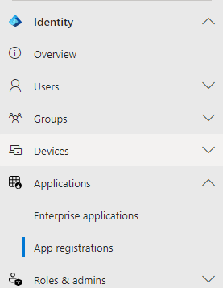

# Configure authd

## Broker discovery

Create the directory that will contain the declaration files of the broker and copy the one from the Entra ID broker snap package:

```shell
sudo mkdir -p /etc/authd/brokers.d/
sudo cp /snap/authd-msentraid/current/conf/authd/msentraid.conf /etc/authd/brokers.d/
```

This file is used to declare the brokers available on the system. Several brokers can be enabled at the same time.

## Entra ID configuration

Register a new application in the Microsoft Azure portal. Once the application is registered, note the `Application (client) ID` and the `Directory (tenant) ID` from the `Overview` menu. These IDs are respectively the `<CLIENT_ID>` and `<ISSUER_ID>` used in the broker configuration file described in this document.

To register a new application, in Entra, select the menu `Identity > Applications > App registration`



Then `New registration`


And configure it as follows:


Under `Manage`, in the `API permissions` menu, set the following Microsoft Graph permissions:


Ensure the API permission type is set to **Delegated** for each permission.

Finally, as the supported authentication mechanism is the device workflow, you need to allow the public client workflows. Under `Manage`, in the `Authentication` menu, under `Advanced settings`, ensure that `Allow public client flows` is set to **Yes**.

[The Microsoft documentation](https://learn.microsoft.com/en-us/entra/identity-platform/quickstart-register-app) provides detailed instructions for registering an application with the Microsoft identity platform.

## Broker configuration

To configure the broker edit the file `/var/snap/authd-msentraid/current/broker.conf`: 

```ini
[oidc]
issuer = https://login.microsoftonline.com/<ISSUER_ID>/v2.0
client_id = <CLIENT_ID>

[users]
# The directory where the home directory will be created for new users.
# Existing users will keep their current directory.
# The user home directory will be created in the format of {home_base_dir}/{username}
# home_base_dir = /home

# The username suffixes that are allowed to login via ssh without existing previously in the system.
# The suffixes must be separated by commas.
# ssh_allowed_suffixes = @example.com,@anotherexample.com
```

Replace `<ISSUER_ID>` and `<CLIENT_ID>` by the issuer ID and client ID retrieved from the MS Entra ID portal.

When a configuration file is added you have to restart authd:

```shell
sudo systemctl restart authd
```

When the configuration of a broker is updated, you have to restart the broker:

```shell
sudo snap restart authd-msentraid
```

## System configuration

By default on Ubuntu, the login timeout is 60s. This may be too brief for a device code flow authentication. It can be set to a different value by changing the value of `LOGIN_TIMEOUT` in `/etc/login.defs`
